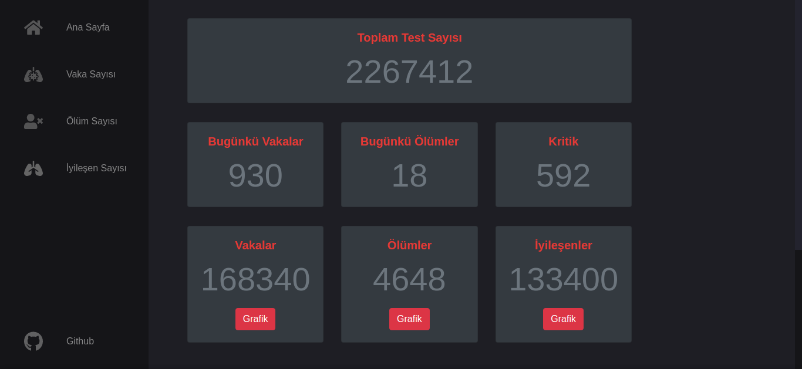
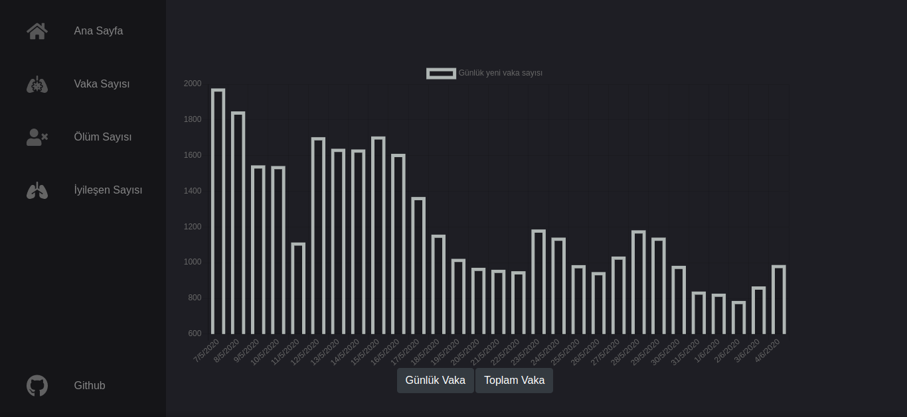
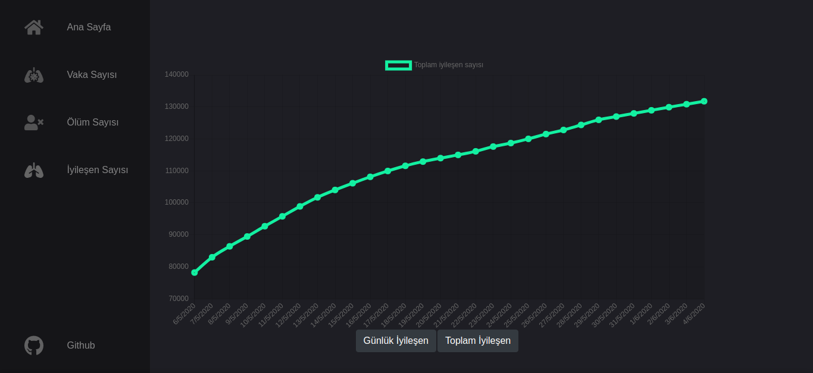

# COVID-19 | Türkiye

Türkiye'deki yeni corona virüsü vaka, ölüm ve iyileşme istatistiksel verilerinin paylaşıldığı platform.

The platform which is being shared the data which is about new corona virus cases, deaths and recovered statistics in Turkey.

# Kullanılan Teknolojiler / Used Technologies
* HTML 5
* CSS 3
* Bootstrap 4
* Chartjs
* JavaScript

# API
<a href="https://github.com/NovelCOVID/API">NovelCOVID API</a>

# Geliştiriciler / Developers
* <a href="https://github.com/efefurkankarakaya">Efe Furkan KARAKAYA</a> (JavaScript Developer & Designer)
* <a href="https://github.com/yusufkerem">Yusuf Kerem ÇALIKOĞLU</a> (Designer & Project Owner)

# LICENCE
<a href="LICENSE">MIT</a>

# Screenshots

## Home

## Daily Cases

## Total Recovered

